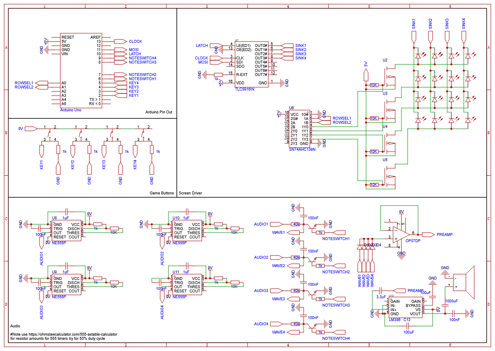

# 🎹 Physical Piano Tiles

A real-life recreation of the popular *Piano Tiles* mobile game, built on a **2ft x 2ft piano** with a **custom LED screen** and **analog audio system**.  

This project uses an **Arduino Uno**, a hand-soldered LED matrix, button inputs, and discrete audio drivers to bring Piano Tiles into the physical world.  

---

## ✨ Features
- 4 playable keys mapped to piano tiles  
- Hand-soldered LED display driven over SPI  
- Analog audio output with 4 channels  
- Win/lose animations (checkerboard + crumble effects)  
- Dynamic difficulty: game speeds up as levels progress   

---

## 🛠️ Hardware Setup
- **Microcontroller:** Arduino Uno  
- **Display:** 4x4 LED matrix (custom wired + multiplexed)  
- **Inputs:** 4 push buttons (keys)  
- **Audio:** 4 analog outputs via transistor drivers  
- **Size:** 2ft x 2ft custom build  

### Pinout (Arduino → Components)
| Pin   | Function          |
|-------|------------------|
| D2–D5 | Key inputs (buttons) |
| D6–D9 | Audio outputs     |
| D10   | SPI latch (LED driver) |
| D11–D13 | SPI bus (MOSI/SCK) |
| A0–A1 | Row select lines  |

---

## 🎵 Gameplay
- Notes fall down the LED grid in sync with a song  
- Hit the correct key at the right time to play the note  
- Wrong key → lose animation  
- Finish the song → win animation and speed up for next level  

---

## 📂 CAD Files
All CAD files for the physical piano build are available here:  
🔗 [Onshape CAD Files](https://cad.onshape.com/documents/6f750370d802f45d631022e7/w/77947f8f69402a572d0c1280/e/21f73c9ca73a5f59ce34e73c?renderMode=0&uiState=686adfc845e90a37d9e83f3e)

---

## 📋 Schematic

---

## 🔧 Parts List

### Capacitors
- 4× 1µF capacitor (0603)
- 9× 100nF capacitor (0603)  
- 2× 100µF capacitor (0603)
- 1× 1000µF capacitor (0603)
- 1× 3.3µF capacitor (0603)

### Semiconductors
- 4× General purpose rectifier diode (SMA package)
- 16× LED, Everlight 19-217/BHC-ZL1M2RY/3T
- 4× NPN transistor (SOT-23)
- 4× P-channel MOSFET transistor

### Resistors
- 8× 10kΩ resistor (0603)
- 13× 1kΩ resistor (0603)
- 4× 40kΩ resistor (0603)

### Mechanical/Interface
- 4× Pushbutton switch (XKB TS-1187A-B-A-B)
- 1× Speaker

### Microcontroller & Logic
- 1× Arduino Uno
- 1× SN74AHC139N, dual 2-to-4 decoder (PDIP-16)
- 1× TLC5916IN, 8-bit LED driver (PDIP-16)

### Analog Components
- 4× 555 timer IC (DIP-8)
- 1× Op-amp (PDIP-8)
- 1× Audio amplifier (SOP-8)

### physical

- plywood 2ft x 2ft
- acrylic 1ft x 1ft
- wood glue / wood screws

---

## 🚀 Getting Started
1. Download the code and open in **Arduino IDE**  
2. Wire the hardware according to the **Pinout**  
3. Upload to the Arduino Uno  
4. Power on and play!  

---

## 🎨 Demo
🔗 [Demo Video](https://drive.google.com/file/d/1tWbtapWxAAcRH7cZoWcML4gQHKBUc-q2/view?usp=sharing)

---
